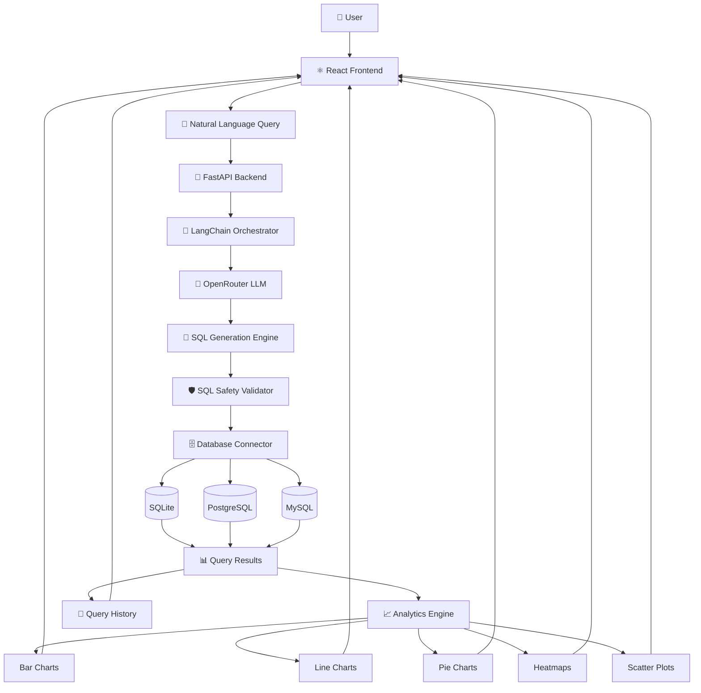
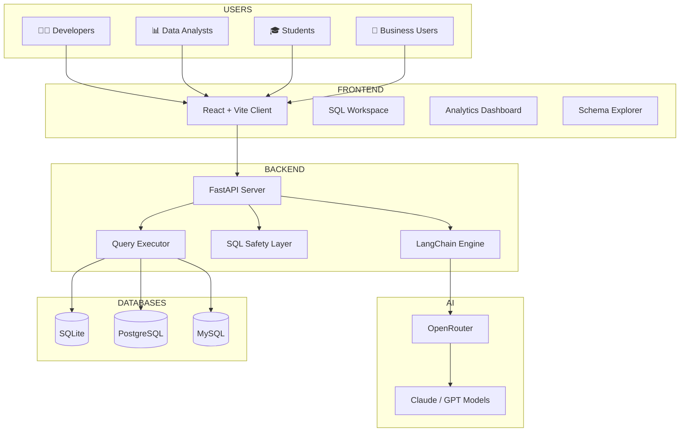
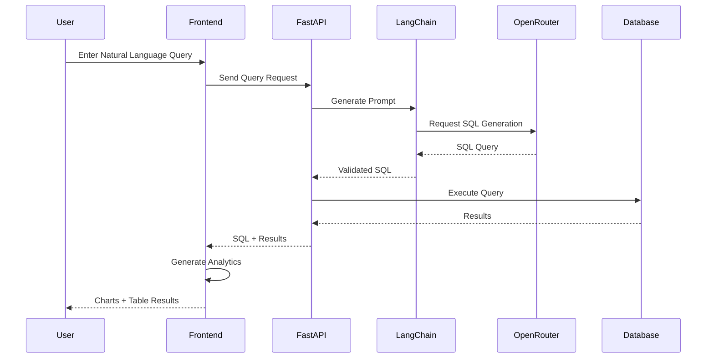
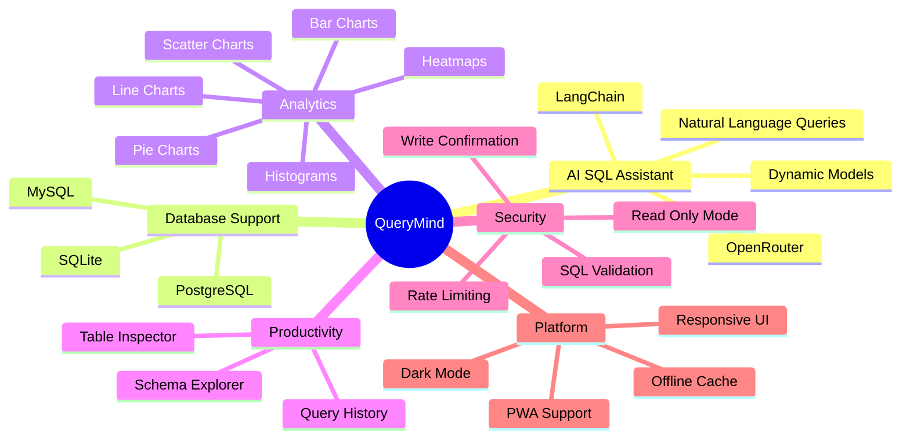

<div align="center">


<br/>
<br/>

</div>

# ✨ Overview

**QueryMind** is an AI-powered SQL Assistant that enables users to interact with databases using plain English.

Built with LangChain, OpenRouter, FastAPI, and React, QueryMind automatically converts natural language questions into executable SQL queries, executes them securely, and visualizes results through interactive analytics dashboards.

The platform combines:

- 🧠 Natural Language to SQL Generation
- 🗄️ Multi-Database Connectivity
- 📊 Interactive Data Analytics
- 🔎 Automatic Schema Exploration
- 📝 Query History Tracking
- 🛡️ Safe Query Execution
- 📱 Progressive Web App Support
Whether you're a developer, analyst, student, or business user, QueryMind makes database interaction faster, easier, and more intuitive.
---
# 📂 Project Structure

```bash
QueryMind/
│
├── backend/
│   │
│   ├── .env                         # OpenRouter & application configuration
│   ├── config.py                    # Environment & application settings
│   ├── main.py                      # FastAPI application entry point
│   ├── models.py                    # Pydantic request/response models
│   ├── seed.py                      # Sample database seeding
│   ├── requirements.txt             # Python dependencies
│   ├── Dockerfile                   # Backend container configuration
│   │
│   ├── chains/
│   │   ├── sql_chain.py             # LangChain SQL generation workflow
│   │   ├── safety.py                # SQL safety validation layer
│   │   └── __init__.py
│   │
│   ├── db/
│   │   ├── connector.py             # Database connection manager
│   │   ├── schema.py                # Schema extraction & inspection
│   │   └── __init__.py
│   │
│   ├── routers/
│   │   ├── table_inspector.py       # Table inspection endpoints
│   │   └── __init__.py
│   │
│   └── tests/
│       ├── test_queries.py          # Query generation tests
│       ├── test_safety.py           # SQL safety tests
│       └── __init__.py
│
├── frontend/
│   │
│   ├── public/
│   │   ├── favicon.svg
│   │   ├── landing.html
│   │   ├── pwa-192x192.png
│   │   └── pwa-512x512.png
│   │
│   ├── src/
│   │   │
│   │   ├── api/
│   │   │   └── client.ts
│   │   │
│   │   ├── components/
│   │   │   ├── QueryInput.tsx
│   │   │   ├── SQLOutput.tsx
│   │   │   ├── ResultsPanel.tsx
│   │   │   ├── ResultsTable.tsx
│   │   │   ├── SchemaTree.tsx
│   │   │   ├── QueryHistory.tsx
│   │   │   ├── ModelSelector.tsx
│   │   │   ├── TableInspector.tsx
│   │   │   └── ConnectionModal.tsx
│   │   │
│   │   ├── analytics/
│   │   │   ├── AnalyticsTab.tsx
│   │   │   ├── AxisSelector.tsx
│   │   │   ├── ChartRenderer.tsx
│   │   │   └── ChartTypeSelector.tsx
│   │   │
│   │   ├── analytics/charts/
│   │   │   ├── AreaChart.tsx
│   │   │   ├── BarChart.tsx
│   │   │   ├── LineChart.tsx
│   │   │   ├── PieChart.tsx
│   │   │   ├── ScatterChart.tsx
│   │   │   ├── HistogramChart.tsx
│   │   │   ├── HeatmapChart.tsx
│   │   │   └── ClusterChart.tsx
│   │   │
│   │   ├── hooks/
│   │   ├── context/
│   │   ├── utils/
│   │   ├── App.tsx
│   │   └── main.tsx
│   │
│   ├── package.json
│   └── vite.config.ts
│
├── uploads/                        # Uploaded SQLite databases
├── sample.db                       # Demo database
├── docker-compose.yml              # Docker deployment
├── README.md
└── .gitignore
```
---
# 🧠 System Architecture


---

# 📦 Deployment Architecture


---
# ⚙️ Query Processing Workflow


---
# 🚀 Feature Architecture


---
# 🚀 Installation Guide

## Prerequisites

Before installing QueryMind, ensure you have:

* Node.js 20+
* Python 3.11+
* npm
* OpenRouter API Key

---

## 1️⃣ Clone Repository

```bash
git clone https://github.com/LoganthP/QueryMind.git
cd QueryMind
```

---

## 2️⃣ Configure Environment Variables

Create a `.env` file inside the **backend/** directory:

```bash
QueryMind/
│
├── backend/
│   ├── .env   ← CREATE HERE
│   └── main.py
│
├── frontend/
└── README.md
```

Create:

```bash
backend/.env
```

Add the following:

```env
OPENROUTER_API_KEY=your_openrouter_api_key_here
MODEL_ID=anthropic/claude-sonnet-4
APP_REFERER=https://querymind.app
APP_TITLE=QueryMind SQL Assistant
DEFAULT_DB_PATH=./sample.db
ALLOWED_ORIGINS=http://localhost:5173
WRITE_MODE_ENABLED=false
MAX_ROWS_RETURNED=500
RATE_LIMIT_PER_MINUTE=20
```

### 🔑 Get Your OpenRouter API Key

1. Visit:

```text
https://openrouter.ai/keys
```

2. Create an account
3. Generate an API key
4. Copy the key
5. Paste it into:

```env
OPENROUTER_API_KEY=sk-or-v1-xxxxxxxxxxxxxxxx
```

> ⚠️ Never commit your `.env` file to GitHub.

---

## 3️⃣ Start the Backend (FastAPI)

We recommend using a Python virtual environment to manage dependencies.

### Windows (PowerShell)

#### Create a Virtual Environment

```powershell
py -3.13 -m venv .venv
```

> ⚠️ Do **NOT** use:
>
> ```powershell
> python -m venv .venv
> ```
>
> On some Windows systems, `python` points to Python 3.14, which may cause dependency compatibility issues.

---

#### Activate the Virtual Environment

```powershell
.\.venv\Scripts\Activate.ps1
```

> ⚠️ Do **NOT** use:
>
> ```powershell
> .\.venv\Scripts\activate
> ```
>
> That script is intended for Bash and will not work correctly in PowerShell.

---

#### Install Dependencies

```powershell
pip install -r backend/requirements.txt
```

---

#### Start the Backend Server

```powershell
uvicorn main:app --reload --app-dir backend
```

If `uvicorn` is not recognized:

```powershell
.\.venv\Scripts\uvicorn.exe main:app --reload --app-dir backend
```

---

### macOS / Linux

```bash
python3 -m venv .venv
source .venv/bin/activate
pip install -r backend/requirements.txt
uvicorn main:app --reload --app-dir backend
```

---

### Backend Features

The backend will:

* Auto-create a `sample.db` database
* Populate sample users, products, and orders
* Start at:

```text
http://localhost:8000
```

* Provide Swagger API documentation at:

```text
http://localhost:8000/docs
```

---

## 4️⃣ Start the Frontend (React + Vite)

Open a new terminal window:

```bash
cd frontend
npm install
npm run dev
```

The frontend will be available at:

```text
http://localhost:5173
```

> The Vite proxy automatically forwards `/api/*` requests to the FastAPI backend.

---

## 🐳 Docker Setup (Alternative)

If you prefer Docker:

```bash
docker compose up --build
```

Both frontend and backend services will start automatically with hot-reloading enabled.

### Docker Services

| Service  | URL                        |
| -------- | -------------------------- |
| Frontend | http://localhost:5173      |
| Backend  | http://localhost:8000      |
| API Docs | http://localhost:8000/docs |

---
# 🏗️ Technology Stack

| Category                       | Technologies                                                                                                  |
| ------------------------------ | ------------------------------------------------------------------------------------------------------------- |
| 🎨 **Frontend**                | ⚛️ React 18 • 🔷 TypeScript • ⚡ Vite • 🎨 Tailwind CSS v4 • 📡 TanStack Query • 📝 CodeMirror 6 • 📊 Recharts |
| 🐍 **Backend**                 | 🚀 FastAPI • 🐍 Python 3.11+ • 🧠 LangChain                                                                   |
| 🤖 **Artificial Intelligence** | 🌐 OpenRouter • 🧩 Claude Models • 🧩 GPT Models • 📝 Prompt Engineering                                      |
| 🗄️ **Database Support**       | 🗄️ SQLite • 🐘 PostgreSQL • 🐬 MySQL                                                                         |
| 🛡️ **Security**               | SQL Validation • Read-Only Execution Mode • Write Confirmation Workflow • Rate Limiting                       |
| 🚀 **DevOps & Deployment**     | 🐳 Docker Compose • 📱 Progressive Web App (PWA) • 🔄 Hot Reloading                                           |
| 📈 **Data Visualization**      | 📊 Recharts • 📉 Line Charts • 📊 Bar Charts • 🥧 Pie Charts • 🔥 Heatmaps • 📍 Scatter Plots                 |
| 🔍 **Database Intelligence**   | Schema Explorer • Table Inspector • Query History • Multi-Database Connectivity                               |
| ⚡ **Developer Experience**     | Swagger API Docs • Type Safety • Hot Reloading • Dockerized Development Environment                           |

---

# 📈 Future Roadmap

- 🤖 AI Query Optimization
- 📄 SQL Explanation Mode
- 👥 Team Workspaces
- 📊 Saved Dashboards
- 📅 Scheduled Queries
- 📤 Export to Excel / CSV
- ⚡ Query Performance Insights
- 🧠 AI Data Analyst Assistant
